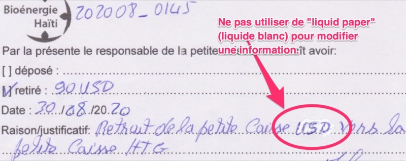
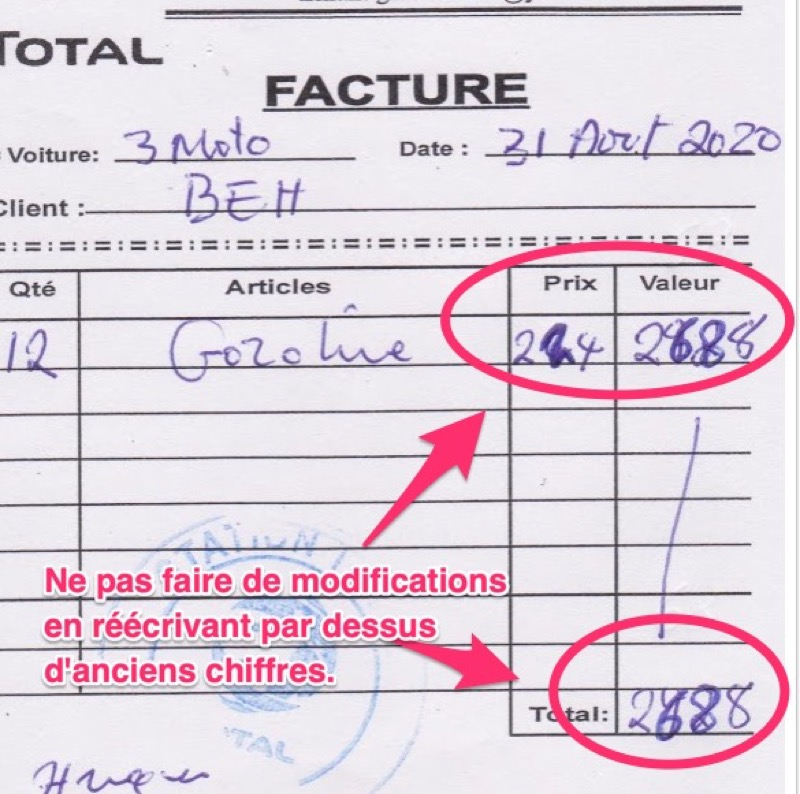
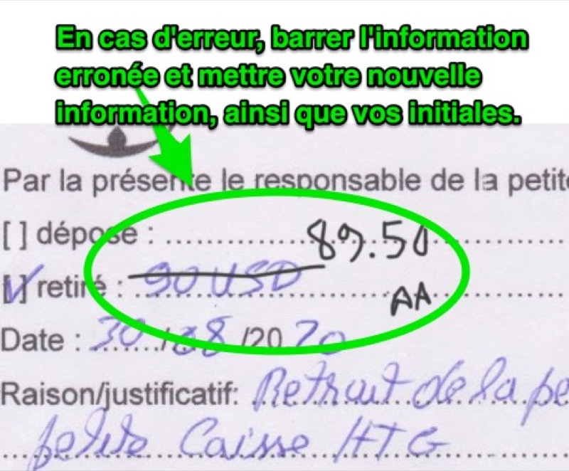

Comment corriger des erreurs
-----

S'il y a une erreur sur une facture, ne jamais mettre du "liquid paper" blanc ou modifier.

Ne jamais réécrire en plus foncé par-dessus d'anciennes informations.

Barrer l'information erronée, puis mettre les nouvelles informations, et ensuite mettres vos **initiales**.

