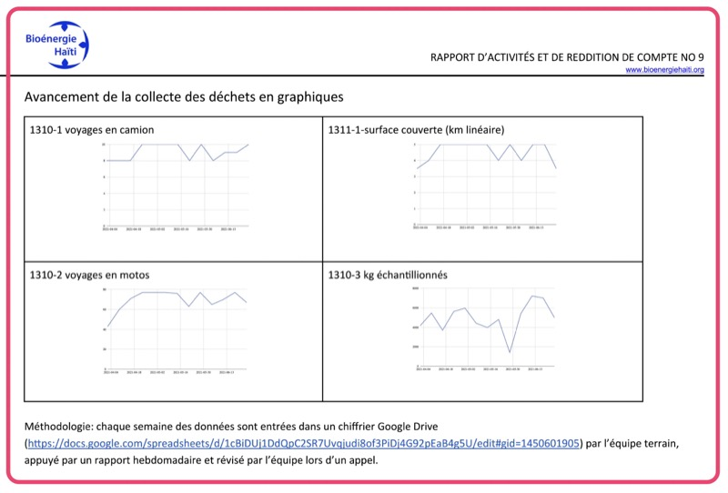
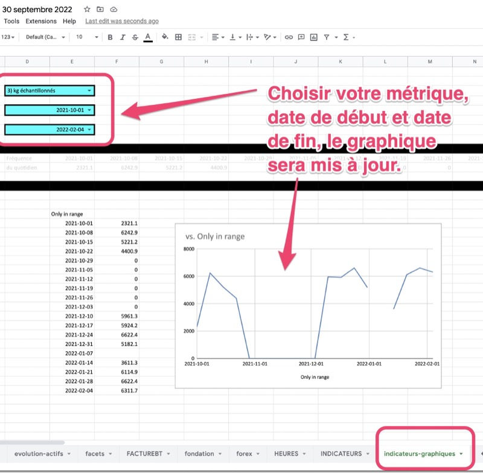

Introduction
-----

Parfois, par exemple dans des rapports trimestriels, il peut être intéressant de générer des graphiques. Dans cet exemples nous montrerons comment génerer ce genre de graphique à partir d'indicateurs de rendement, pour faire des pages comme ça:

Les données sous-jacentes
-----

Dans cet exemple, il est important de bien remplir les **indicateurs de rendement** qui servent de données sous-jacentes.

Nous favorisons le chiffrier comptable annuel pour entrer les indicateurs de rendement.

L'onglet "indicateurs-graphiques"
-----

Dans l'exemple de BEH 2021-2022, nous avons un onget indicateurs-graphiques, ou on peut choisir une métrique, une date de début et une date de fin (les trois en bleu pâle); et générer avec ces données un graphique.

Vous pouvez ensuite utiliser la fonction capture d'écran de votre ordinateur pour sauvegarder les graphiques comme images.

Obtenir de l'aide
-----

Vous pouvez demander via le groupe WhatsApp pour tout support technique ou bogue pour la génération de graphique.
