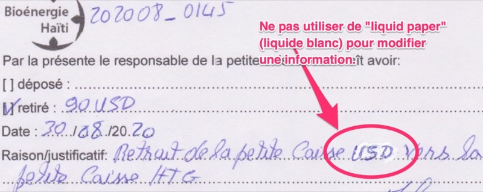
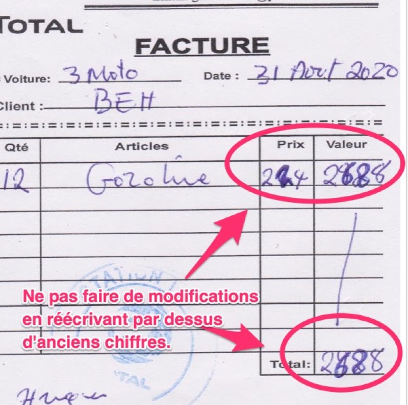
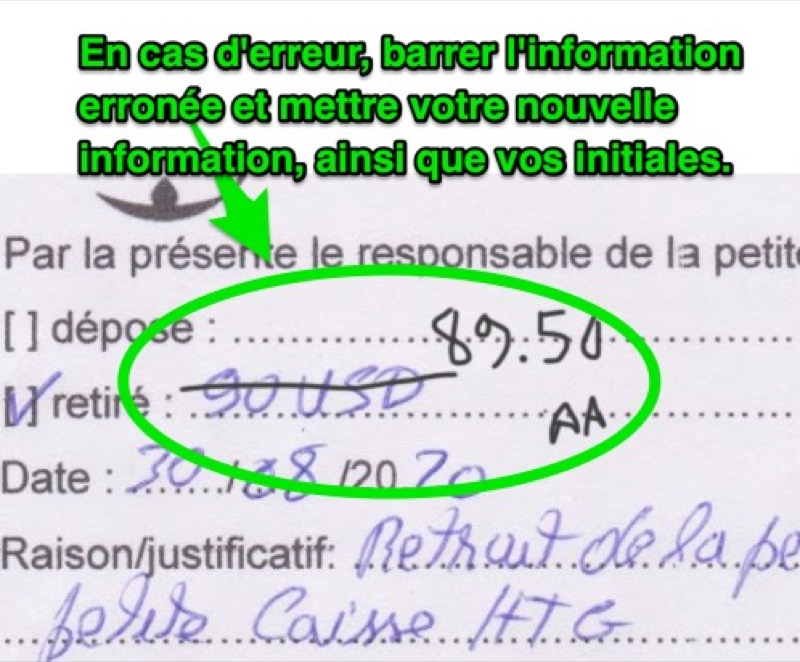

La reddition de compte sert à assurer qu'il y ait en place plusieurs mises en garde pour éviter fraude, erreurs, oublis.

Toutes les activités de l'organisme doivent être facilement comprises, prouvées, même plusieurs années plus tard.

Une bonne reddition de compte permet aux bailleurs de fonds (par exemple les payeurs de taxes des gouvernements qui subventionnent les projet) d'en avoir pour leur argent; elle permet en plus de démontrer une saine gestion et ainsi accueillir de nouveaux partenaires.

Comptabilité
-----

Tout mouvement d'argent doit être entré dans [votre système comptable décrit à la page "Comptabilité"](/comptabilite).

Preuves
-----

Tout mouvement d'argent doit faire l'objet de preuve. Toute facture doit raisonnablement démontrer que l'argent a été reçu par le fournisseur de service.

* Une facture d'une station d'essence est suffisante mais il doit être possible de faire une référence croisée avec l'utilisation réelle des véhicules, pour éviter, par exemple, que l'utilisation d'essence ne soit utilisé autrement que pour les opérations.
* Pour des plus petits fournisseurs, la signature d'une personne indiquant "Payé -- j'ai reçu [MONTANT]" avec son numéro de téléphone, et une photo de sa carte d'identitié. (Une étampe "PAYÉ" ne suffit pas!)

Conservation de documents
-----

Tous les bailleurs de fonds ont des exigences différentes sur la conservation des documents (comptables, preuves). Nous conseillons de tout garder en format électronique pour au moins dix (10) ans. Il est important de garder les documents à plusieurs endroits pour éviter toute perte de donnée en cas de bris informatique.

Juste prix
-----

L'organisme est responsable de toujours trouver le meilleur prix pour tout service. Pour des plus grosses dépenses, documentez 3 différentes sources (par exemple en obtenant des devis ou photographiez des publicités).

Exemples de fraude
-----

Il est possible que vous ayez affaire à des employés peu scrupuleux qui tentent de frauder l'organisme ou ses bailleurs de fonds. Par exemple:

* Faire affaire avec un garagiste qui redonne une partie des fonds (par exemple 10%) en argent comptant à l'employé pour chaque service rendu.
* Falsifier des devis.
* Faire des paiements pour services non-rendus.

Ses activités sont criminels et il vous incombe de mettre en place des procédures pour les éviter.

Vérification et audit
-----

Une vérification complète aura lieu de toutes vos activités. Généralement les dépenses importantes seront vérifiées:

* certains fournisseurs de service (hôtels, garagistes, restaurateurs) seront visités sur place.
* une étude de marché sera faite pour confirmer que vous avez fait votre possible pour obtenir le meilleur prix pour les services reçus.
* des employés seront interviewés.
* on vous demandera de voir (physiquement) les biens achetés.

Politique d'acquisition de biens et services
-----

Vous devez mettre en place une d'acquisition de biens et services. Par exemple:

* Pour toute dépense de plus de 250$CAD, deux personnes doivent signer qu'elle est nécessaire.
* Pour toute dépense de plus de 1000$CAD, trois différents devis sont nécessaires.

Rétroaction et lanceurs d'alerte
-----

Toute personne désireuse d'informer la conseil d'administration de manquements aux politiques de façon anonyme peut le faire en visitant la page [/retroaction].

Indicateurs de performance et heures travaillées
-----

Votre reddition de compte documentera différents indicateurs de performance tels:

* heures réellement travaillées
* heures bénévoles
* tonnage collecté
* km parcouru
* tout autre indicateur demandé par le bailleur de fonds

Il est important que tous vos indicateurs soient traçables et vérifiables. Voici un exemple: si votre indicateur de performance indique que vous avez ramassé 40 tonnes de déchets dans une semaine, il doit être possible, même plusieurs années plus tard, pour un vérificateur qui ne connaît pas le projet de comprendre qui a entré ces données, comment elles ont été calculés, quels jours ont été travaillés, qui sont les employés, etc. Lors d'une vérification en profondeur, toutes les personnes impliqués dans vos activités peuvent être interviewés pour confirmer la validité des données.

Surveillance multiple
-----

* Un employé ne peut pas être son propre superviseur.
* Généralement une seule personne ne peut pas retirer de l'argent du compte en banque ou de la petite caisse, sauf pour des petits clairement définis.

Change d'argent
-----

Chaque fois que vous changez de l'argent, vous devez obtenir un reçu qui indique le taux obtenu, le montant échangé.

Registre des biens
-----

Durant toute subvention votre organisme fera l'acquisition de biens, par exemple des véhicules, des meubles, etc. Vous devez tenir un registre des biens durables et de faire un plan de disposition. Par exemple, un bailleur de fonds qui paie pour un véhicule s'attendra à obtenir une description de ce qui arrivera au véhicule après le projet. Idem pour les gros achats tels gros meubles, génératrice, panneau solaire, etc.

Comment corriger des erreurs
-----

S'il y a une erreur sur une facture, ne jamais mettre du "liquid paper" blanc ou modifier.

Ne jamais réécrire en plus foncé par-dessus d'anciennes informations.

Barrer l'information erronée, puis mettre les nouvelles informations, et ensuite mettres vos **initiales**.

